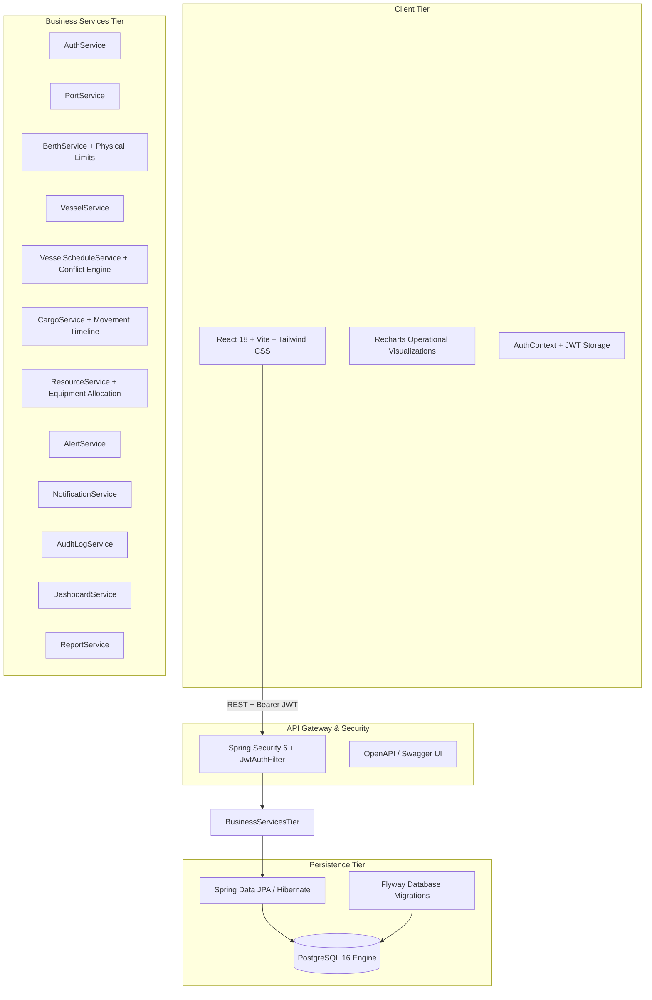

# PORTWISE — Architecture Documentation
**Connecting Ports. Powering Progress.**

## 1. System Overview
PORTWISE is a multi-tier enterprise web application architected for commercial port logistics, vessel scheduling, berth optimization, and multi-modal cargo tracking.

## 2. Layered Architecture

### Backend (`com.portwise`)
- **`config/`**: Stateless Spring Security 6 filter chain, CORS mapping, Swagger SpringDoc OpenAPI configuration.
- **`controller/`**: REST API endpoints with HTTP method semantics, input validation (`@Valid`), role restrictions (`@PreAuthorize`).
- **`service/`**: Business logic encapsulation, transaction management (`@Transactional`), rule evaluation.
- **`repository/`**: Spring Data JPA repositories with custom JPQL queries for overlap detection and active filters.
- **`entity/`**: Relational entities with JPA annotations, auditing timestamps, soft-delete flags, and enum mappings.
- **`dto/`**: Request and response data transfer objects to prevent entity leakage.
- **`exception/`**: Centralized `@RestControllerAdvice` mapping domain exceptions (`ResourceNotFoundException`, `ConflictException`, `BadRequestException`, `ForbiddenException`) to consistent `ApiResponse<T>` envelopes.
- **`security/`**: JJWT 0.12.x token generation, signing, claims validation, and UserDetailsService.

### Frontend (`src/`)
- **`context/`**: React Context for authentication state, user identity, and role-based permissions (`hasRole`).
- **`services/`**: Axios client with request bearer token injection and 401 response handling.
- **`layouts/`**: `DashboardLayout` combining `Sidebar`, `TopNavbar`, and `DemoBanner`.
- **`components/`**: Reusable widgets (`KpiCard`, `StatusBadge`, `Modal`, `ConfirmDialog`, `LoadingSpinner`, `EmptyState`).
- **`pages/`**: Feature-complete views for Vessels, Schedules, Cargo, Ports, Berths, Resources, Alerts, Notifications, Reports, Users, and Audit Trail.

## 3. Strict Business Rules Implementation
1. **Berth Conflict Detection**: JPQL overlapping window validation prevents booking berths simultaneously.
2. **Draft Limit Enforcement**: Vessel draft cannot exceed berth maximum draft.
3. **LOA Limit Enforcement**: Vessel length overall (LOA) cannot exceed berth maximum length.
4. **Resource Conflict Prevention**: Heavy equipment (cranes, forklifts) cannot be allocated to concurrent active jobs.
5. **Role-Based Authorization**: Berthing approvals and administrative user edits are strictly protected by role guards (`@PreAuthorize("hasAnyRole(...)")`).
6. **Cargo Custody Immutability**: Completed cargo consignments cannot be reverted to `REGISTERED` status.
