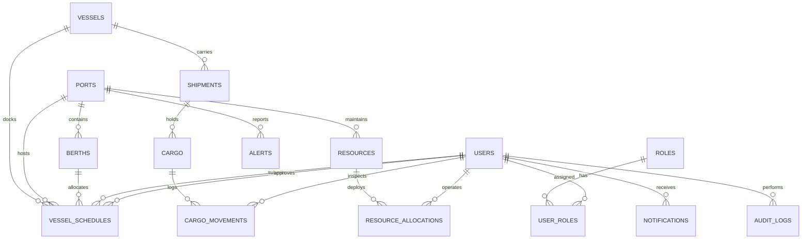

# PORTWISE — Relational Database Specification
**Database Engine**: PostgreSQL 16
**Default Database**: `portwise_db`

## 1. Entity-Relationship Schema

## 2. Table Catalog

| Table | Primary Key | Key Foreign Keys | Purpose |
|---|---|---|---|
| `roles` | `id` | — | Role definitions (ADMIN, PORT_AUTHORITY, etc.) |
| `users` | `id` | — | Authenticated users and operators |
| `user_roles` | `(user_id, role_id)` | `user_id`, `role_id` | Many-to-many role mapping |
| `ports` | `id` | — | Major port authority locations and coordinates |
| `berths` | `id` | `port_id` | Physical berths, maxDraft, maxLOA, and status |
| `vessels` | `id` | — | Vessel registry, IMO numbers, naval dimensions |
| `vessel_schedules`| `id` | `vessel_id`, `port_id`, `berth_id` | Docking schedules, approval workflow |
| `shipments` | `id` | `vessel_id`, `origin_port_id`, `destination_port_id` | Multimodal shipment containers |
| `cargo` | `id` | `shipment_id`, `owner_id` | Consignment details, commodity type, quantity |
| `cargo_movements`| `id` | `cargo_id`, `operator_id` | Custody timeline events and location logs |
| `resources` | `id` | `port_id` | Cranes, forklifts, trucks, and storage areas |
| `resource_allocations`| `id` | `resource_id`, `operator_id` | Active work assignments and timelines |
| `alerts` | `id` | `port_id` | Operational alarms and warnings |
| `notifications` | `id` | `user_id` | In-app user notifications |
| `audit_logs` | `id` | `user_id` | System audit trail for traceability |

## 3. Database Indexes
- `idx_users_email` ON `users(email)`
- `idx_berths_port_id` ON `berths(port_id)`
- `idx_vessel_schedules_berth_id` ON `vessel_schedules(berth_id)`
- `idx_vessel_schedules_eta` ON `vessel_schedules(eta)`
- `idx_cargo_status` ON `cargo(status)`
- `idx_cargo_movements_cargo_id` ON `cargo_movements(cargo_id)`
- `idx_resources_port_id` ON `resources(port_id)`
- `idx_alerts_status` ON `alerts(status)`
- `idx_notifications_user_id` ON `notifications(user_id)`
- `idx_audit_logs_user_id` ON `audit_logs(user_id)`
