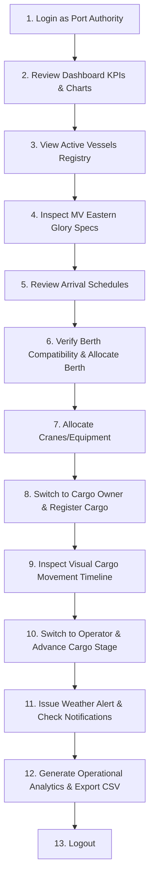

# PORTWISE — Demonstration Guide
**Connecting Ports. Powering Progress.**

This guide walks through the end-to-end operational flow of the PORTWISE system using the pre-seeded DEMO DATA.

---

## 1. Demo Credentials

All demonstration accounts use the password: `Demo@12345`

| Role | Email Address | Primary Responsibilities |
|---|---|---|
| **ADMIN** | `admin@portwise.demo` | User management, port configuration, system audit trail |
| **PORT AUTHORITY** | `portauthority@portwise.demo` | Berth management, docking approvals, resource allocation, incident alerts |
| **SHIPPING AGENT** | `agent@portwise.demo` | Vessel registration, schedule arrival requests, tracking |
| **CARGO OWNER** | `cargo@portwise.demo` | Cargo registration, consignment timeline tracking, reports |
| **LOGISTICS OPERATOR** | `operator@portwise.demo` | Handling cargo movements, resource operations, status updates |

> [!NOTE]
> The login screen includes **one-click demo account selector buttons** to effortlessly test each role without typing credentials manually.

---

## 2. Complete Step-by-Step Demonstration Flow

### Step 1: Login
1. Navigate to `http://localhost:5173/login`
2. Click the **PORT AUTHORITY** demo button (`portauthority@portwise.demo`)
3. Click **Sign in to Terminal**

### Step 2: Operational Dashboard
1. Notice the top banner clearly displaying: `DEMO ENVIRONMENT — Active Demonstration Mode`
2. Review the live KPI cards: Active Vessels, Cargo In Transit, Berths Occupied, etc.
3. Observe the live charts generated from the database: Vessel Status Distribution & Cargo Pipeline.

### Step 3: Vessel Registry
1. Click **Vessels** in the sidebar.
2. Search for `MV Eastern Glory` or filter by status `ARRIVING`.
3. Click the view icon to inspect the naval architecture details (Draft: 13.5m, DWT: 75,000 MT, LOA: 225m).

### Step 4: Schedule Review & Berth Allocation
1. Click **Schedules** in the sidebar.
2. Locate the pending docking request for `MV Blue Horizon` or `MV Pacific Dawn`.
3. Click **Review & Allocate**.
4. The system validates:
   - Physical maximum draft of the chosen berth vs vessel draft.
   - Physical maximum LOA of the chosen berth vs vessel LOA.
   - Overlap conflict with existing schedules.
5. Select an available compatible berth and click **Confirm Decision**.

### Step 5: Resource Deployment
1. Click **Equipment & Resources** to inspect available cranes, forklifts, and storage areas.
2. Click **Resource Allocations** → **Create Allocation**.
3. Select an available crane and assign it to an unloading task. Conflicting assignments are automatically rejected.

### Step 6: Cargo Registration & Tracking Timeline
1. Switch to `cargo@portwise.demo` (or stay as Admin).
2. Go to **Cargo Movements** → click **Register Cargo**.
3. Register 50,000 MT of Thermal Coal.
4. Click **Timeline** to view the interactive chain-of-custody timeline.
5. Click **Add Tracking Event** to log inspection, customs clearance, or vessel loading.

### Step 7: Incident Management & Notifications
1. Go to **Alerts & Incidents** → click **Raise Incident Alert**.
2. File a gale or maintenance warning.
3. Check the bell icon in the top navigation bar to see incoming live operational notifications.

### Step 8: Reports & CSV Export
1. Click **Reports & Analytics**.
2. Review the throughput trajectory line chart and traffic density bar charts.
3. Click **Export Operational CSV** to download the official operational report.
